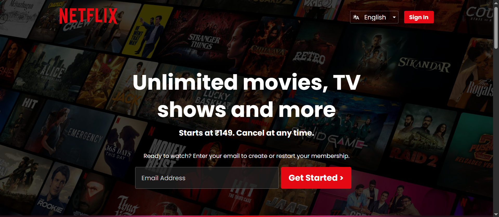

# Netflix Clone Landing Page

This project is a Netflix Landing Page Clone created using **HTML** and **CSS** only. It is fully responsive and mimics Netflix’s modern and sleek UI without any JavaScript.

---

## 📌 Features

- ✅ **Fully Responsive Design** (Mobile, Tablet, and Desktop)
- ✅ **Hero Section** with background image and overlay
- ✅ **Language Selector Dropdown**
- ✅ **Sign-In Button**
- ✅ **Trending Cards Section**
- ✅ **Reasons to Join Section** with modern cards
- ✅ **Interactive FAQs Section** (Click to expand/collapse using pure CSS)
- ✅ **Email Signup Sections**
- ✅ **Styled Footer Section**
- ✅ **Mobile-First Responsive Media Queries**
- ✅ **Clean CSS Animations and Hover Effects**

---

## Functional Highlights

### 1. **CSS Only FAQ Toggle**
- Each FAQ uses a hidden checkbox and label combination to toggle the answer display without JavaScript.
- Plus and Cross icons change on hover for interactive feel.

### 2. **Hover Animations**
- Card hover effects (scale up and number animation).
- Reason cards slightly zoom in on hover.

### 3. **Responsive Layout**
- Uses media queries for screen sizes ranging from desktop (>1200px) to very small devices (<340px).
- Grid layouts are adapted dynamically.

### 4. **Language Dropdown**
- Static language switcher styled for both main navigation and footer.

### 5. **Clean and Modern Layout**
- Hero section with promotional text.
- Cards displaying trending shows/movies.
- Multiple call-to-action (CTA) email sections.

---

## 🖼️ Preview



## 📁 Folder Structure

```
Netflix-Clone/
│
├── assets/
│   ├── bg.jpg                # Background image for the hero section
│   ├── logo.svg              # Netflix logo
│   ├── language.svg          # Language icon
│   ├── arrow.svg             # Dropdown arrow icon
│   ├── plus.svg              # FAQ plus sign
│   ├── cross.svg             # FAQ close sign
│   ├── squid games.webp      # Trending card image
│   ├── Raid2.webp
│   ├── kapil sharma.webp
│   ├── thug life.webp
│   ├── 7hit.webp
│   ├── jaisa koi.webp
│
├── index.html                # Main HTML file
├── style.css                 # Main CSS file
└── README.md                 # Project documentation
```


## How to Run This Project

1. Visit the live website deployed on **GitHub Pages**.
2. **[Click Here to View Live Project](https://netflix-ui-clone-kartik-sharmas-projects-00c4c29f.vercel.app/)** 
3. Explore the fully responsive Netflix Landing Page Clone directly from your browser — no setup required!


---

## Author

Cloned with ❤️ by **Kartik Sharma**

---

## Note

This project is purely educational and for practice purposes. It doesn’t connect to Netflix or any backend services.

